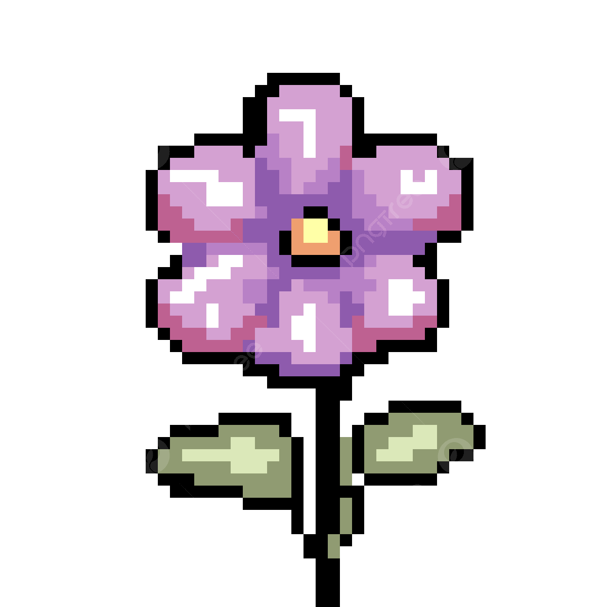

<em>hey there!</em> i'm

<h1 align="center">
  
  Azka Siddiqui
  
</h1>

ce @ [UWaterloo](https://uwaterloo.ca/) + schulich leader:
- Currently studying Computer Engineering at the University of Waterloo on a full-ride $100K Schulich Leader Scholarship, pursuing my interests in robotics, embedded systems, and controls. I’m especially drawn to projects that sit at the intersection of software and hardware.
- Interested in software for social good, ml/ai, & accessible coding education
- Prev high school software engineering intern (FutureTech) [@Nokia](https://www.nokia.com/)
- I’m always open to new ideas, projects, and conversations. if you’re working on something inspiring or want to collaborate, let’s connect at azka.siddiqui@uwaterloo.ca!

  

<!--      -->
    
    
  

